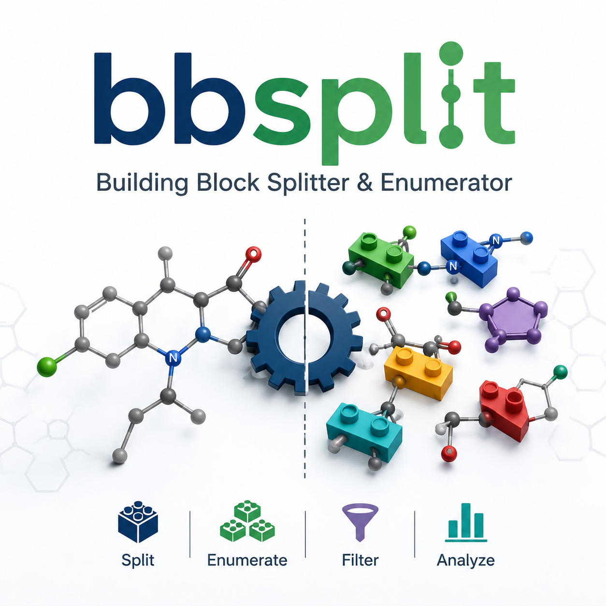

<p align="center">
  
</p>
# bbsplit — Building Block Splitter & Enumerator
**bbsplit** breaks molecules into building blocks using a base of retrosynthetic
SMARTS rules, shows **every possible way** to disconnect each molecule, and runs
a **combinatorial enumeration** of the blocks back into new compounds. It ships
with a styled desktop GUI (PySide6) and a headless CLI, and can run splitting and
enumeration **in parallel** across multiple CPU cores.

> It grew out of a simple task: "split amide/amine compounds into two blocks and
> do a Cartesian A×B enumeration." bbsplit generalises this to an arbitrary set
> of bond types and to disconnections across 1–2 bonds (up to 3 blocks).

---

## Features

- **Multi-format input.** CSV, SMILES lists (`.smi` / `.txt`, optional name as a
  second token), and SD files (`.sdf` / `.mol`, using the title line as ID).
- **Structure previews.** Accepted molecules are shown as a gallery of rendered
  structures on the Input tab.
- **Multi-way disconnection.** Each molecule can be cut in several ways across a
  rich rule base (amide, sulfonamide, urea, carbamate, ester, N-alkylation,
  reductive amination, ether, aryl ether, aryl amine, thioether, triazole,
  biaryl, Sonogashira, imine). Conflicts on a bond are resolved by priority.
- **1- or 2-bond cuts** → 2 or 3 building blocks. Depth is configurable.
- **Both blocks visible.** The Disconnections tab renders **every** resulting
  building block of a chosen cut side by side.
- **Immediate application.** Any rule/depth change re-splits all molecules at
  once — no separate "run" step.
- **Reverse recombination** by stitching dummy atoms `[*]` — products come out
  as canonical SMILES with optional deduplication.
- **Molecular descriptors.** Each product is annotated with MW, cLogP, HBD, HBA,
  TPSA, rotatable bonds, ring count, aromatic ring count, heavy-atom count and
  fraction sp3. The GUI table sorts by any descriptor (click a header); the CLI
  sorts via `--sort-by`.
- **Inline product structures** rendered in the results table.
- **Stable IDs.** Products get IDs like `ENU0001` (≥3 letters + digits); blocks
  use `A0001` / `B0001`.
- **Real parallelism.** Splitting and enumeration use independent worker
  processes (`concurrent.futures.ProcessPoolExecutor`); the OS schedules them
  across all available cores. Worker count is selectable in the GUI and CLI and
  may exceed the core count if desired.
- **Export** to CSV.

---

## Installation

RDKit installs most reliably via conda:

```bash
conda env create -f environment.yml
conda activate bbsplit
```

Alternatively (pip; RDKit has wheels on PyPI for most platforms):

```bash
python -m venv .venv && source .venv/bin/activate
pip install -r requirements.txt
```

As a package (adds the `bbsplit` command):

```bash
pip install -e .
```

---

## Running

**GUI:**

```bash
python app.py        # or: python -m bbsplit        # or, after install: bbsplit
```

**CLI (headless), any supported input format:**

```bash
python cli.py examples/sample_input.csv --smiles-col SMILES --id-col ID \
    --max-bonds 2 --workers 4 --sort-by MW --descending --out enumerated.csv

python cli.py examples/sample_input.smi --workers 4 --out enumerated.csv
python cli.py examples/sample_input.sdf --workers 0 --out enumerated.csv
```

`--workers`: `1` serial, `N>1` N worker processes, `0` all CPUs. `--sort-by`
accepts any descriptor (MW, LogP, HBD, HBA, TPSA, RotB, Rings, ArRings, HAC,
FCsp3); add `--descending` to reverse.

---

## GUI workflow

1. **Input.** Load a CSV (pick the SMILES/ID columns) or a `.smi`/`.txt`/`.sdf`
   file, or paste SMILES. Accepted molecules appear as a **structure gallery**.
2. **Rules.** Enable/disable bond types, add a custom YAML, set the disconnection
   depth (1–3 bonds), and choose the number of parallel workers. **Every change
   is applied immediately.**
3. **Disconnections.** A read-only viewer: pick a molecule, pick a way to cut it,
   and see **all resulting building blocks rendered side by side**.
4. **Enumerate.** Build the block pool, choose a mode (all×all / reproduce inputs
   / one fixed block × all) and a worker count, run it, and view product
   structures plus a **sortable descriptor table** (click any header). Export to
   CSV.

---

## Rule base

Default rules live in [`bbsplit/default_rules.yaml`](bbsplit/default_rules.yaml);
several extra coupling types ship disabled by default (biaryl, Sonogashira,
thioether, triazole, imine, reductive amination) and can be toggled on in the
GUI or via a custom YAML. Each rule is a SMARTS matching the **two atoms flanking
the bond** to break, plus a priority and description:

```yaml
rules:
  - name: amide_CN
    smarts: "[CX3;$([CX3]=[OX1])]!@[NX3]"
    priority: 90
    description: "Amide bond C(=O)-N."
    enabled: true
```

See [`custom_rules.example.yaml`](custom_rules.example.yaml) for adding your own.

---

## API (core)

```python
from bbsplit.core import RuleSet, SplitEngine, combine_two
from bbsplit.parallel import split_molecules, enumerate_blocks_parallel
from bbsplit.descriptors import compute_descriptors
from bbsplit import io_formats

mols = io_formats.detect_and_read("library.sdf")           # or read_csv(...)
disc = split_molecules(mols, RuleSet.default(), max_bonds=2, workers=4)
products = enumerate_blocks_parallel(pool_a, pool_b, dedup=True, workers=4)
compute_descriptors("CC(=O)Nc1ccccc1")                     # -> dict of descriptors
```

---

## Project layout

```
bbsplit/
├── app.py                     # GUI launcher
├── cli.py                     # headless CLI (CSV/SMI/TXT/SDF)
├── bbsplit/
│   ├── core.py                # engine: rules, disconnection, enumeration
│   ├── parallel.py            # parallel split & enumeration (processes)
│   ├── descriptors.py         # molecular descriptor calculation
│   ├── io_formats.py          # CSV / SMI / TXT / SDF readers
│   ├── gui.py                 # PySide6 interface (styled)
│   ├── render.py              # molecule rendering for the GUI
│   └── default_rules.yaml     # default rule base
├── examples/                  # sample_input.csv / .smi / .sdf
├── custom_rules.example.yaml
├── tests/test_core.py
├── requirements.txt
├── environment.yml
└── pyproject.toml
```

---

## Tests

```bash
pytest -q
```

---

## Limitations & notes

- **Chemical validity is the user's call.** With many rules enabled, the block
  pool contains reactive fragments, and a full A×B enumeration can produce
  formally valid but odd compounds. Narrow the rule set to your task.
- **Trivial fragments** (e.g. `[*]N`) are filtered by default in the GUI.
- **Rings are not broken** (cuts restricted to non-ring bonds, `!@`).
- **Parallelism** uses processes; the first call carries pool-startup overhead,
  so it pays off mainly on larger inputs — keep `workers=1` for small sets. Each
  worker is a real OS process, so work spreads across cores on multi-core hosts.

---

## License

Apache License 2.0 — see [LICENSE](LICENSE).
